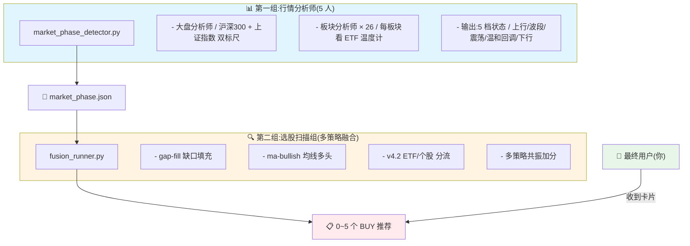
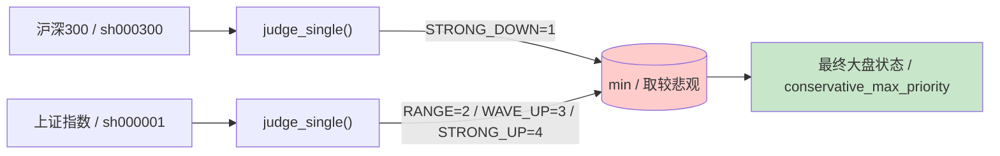
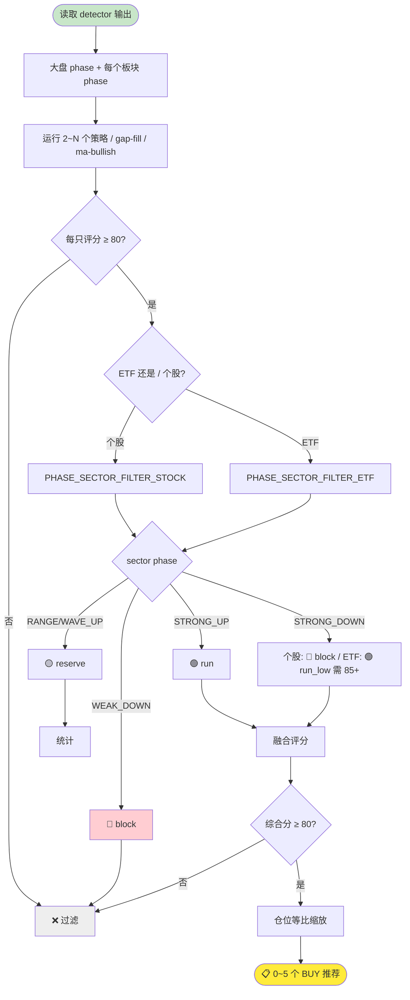
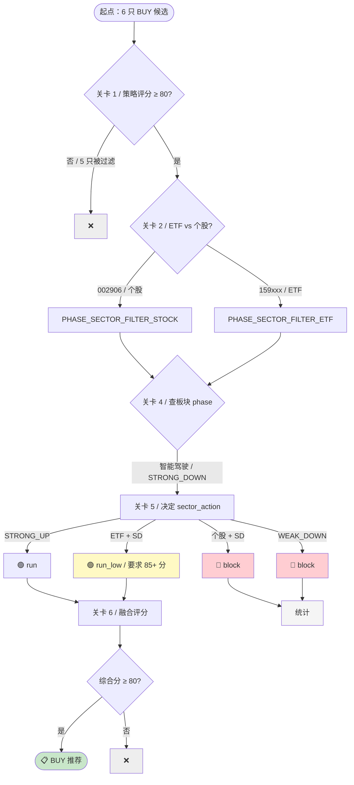

# 🎯 策略融合投资顾问 - 设计文档

> 📅 **当前版本**：v4.3.1（2026-09-09，券商 v9 放宽参数 + coal_v9）  
> 📊 **数据时间**：2026-09-09 收盘  
> 👥 **目标读者**：投资者、产品经理、技术新手  
> 🔖 **文档定位**：理解整套系统的"是什么 / 为什么 / 怎么用"

---

## 📑 目录

| # | 章节 | 内容概要 |
|---|---|---|
| 1 | [🌟 整体架构](#一整体架构) | 三层分工比喻 + Mermaid 流程图 |
| 2 | [📊 行情分析师 detector](#二行情分析师) | 双标尺合并 + 5 档状态 + WEAK_DOWN 故事 |
| 3 | [🔍 选股扫描器 fusion_runner](#三选股扫描器) | 6 道关卡 + 时段分组 + 融合计分 |
| 4 | [📈 回测参数详解](#四回测参数详解) | 胜率/复利/最大亏/T+N 含义 |
| 5 | [💼 26 个板块 ETF 全表](#五板块-etf) | 完整 ETF 列表 + 当前指标 + 相关性 |
| 6 | [🎯 上周实战验证](#六上周实战) | 真实 BUY 信号 + 实际收益 |
| 7 | [❓ FAQ](#七常见问题) | 9 个常见问题详细解答 |
| 8 | [🕐 版本演进](#八版本演进) | v3 → v4.2 性能变化 |
| 9 | [🚀 运行命令](#九运行命令) | 速查表 |
| 10 | [🔧 故障排查](#十故障排查) | 4 类问题诊断 |

---

## 一、🌟 整体架构

> 💡 **核心比喻**：本系统就像一个**投资顾问团队**，3 类人各司其职。



### 🎯 一句话总结

| 组别 | 职责 | 输出 |
|---|---|---|
| 📊 行情分析师 | 判断"大盘/板块该不该买" | 5 档 phase 标签 |
| 🔍 选股扫描器 | 在判断通过的板块里"挑具体股票" | 0~5 个 BUY 推荐 |
| 👤 用户 | 收到推荐，做最终决策 | 实际交易 |

---

## 二、📊 行情分析师：`market_phase_detector.py`

### 2.1 📁 文件位置

```bash
strategy-fusion-advisor/skills/scripts/market_phase_detector.py
```

**运行命令**（每天早晨跑一次）：

```bash
cd strategy-fusion-advisor/skills/scripts
python market_phase_detector.py
```

**输出文件**：
- `recommendations/market_phase.json`（主输出）
- `recommendations/cache/stable_phase.json`（跨进程缓存）

### 2.2 🎚️ 大盘状态怎么判断？

**双标尺 + 保守合并**：



> ⚠️ **关键设计**：取较悲观档而非较乐观档——**漏掉风险会亏钱，错过机会只会少赚**。

**优先级排序**（PHASE_PRIORITY）：

| 档位 | 优先级值 | 越悲观越小 |
|---|---|---|
| 🛑 STRONG_DOWN 下行 | 1 | 最小 |
| 🛑 WEAK_DOWN 温和回调 | 1 | |
| 🟡 RANGE 震荡 | 2 | |
| 🟡 WAVE_UP 波段 | 3 | |
| 🟢 STRONG_UP 单边上行 | 4 | 最大 |

**举例**：
- 沪深300 = RANGE (2) + 上证 = WAVE_UP (3) → 取 RANGE (2)
- 沪深300 = RANGE (2) + 上证 = STRONG_DOWN (1) → 取 STRONG_DOWN (1)

### 2.3 🎯 5 档状态的判定规则

`judge_single()` 对**任何标的**（大盘、板块、ETF）判定档位，按优先级**先满足先得**：

| 档位 | 触发规则 | 操作建议 | 评分 |
|---|---|---|---|
| 🛑 **STRONG_DOWN 下行** | `close < MA20 < MA60`（空头排列）<br>**或** 距 60 日高点回撤 > 15% | 不买 | 0 |
| 🛑 **WEAK_DOWN 温和回调** 🆕 | `close < MA20 但 close > MA60` + 回撤 < 10% | 不买 | 0 |
| 🟡 **RANGE 震荡** | 价格在 MA60 ±5% 内 + 60 日振幅 < 15% | 仅小仓 | 90 |
| 🟡 **WAVE_UP 波段** | close > MA60 + MA20 走平（10 日斜率 < 0.3%）+ 20 日振幅 8%~15% | 只低吸 | 85 |
| 🟢 **STRONG_UP 单边上行** | close > MA20 > MA60 + MA20 连上 10 日 + 近 20 日涨幅 > 8% | 可追 | 80 |

### 2.4 📖 通俗解读：MA20 / MA60 是什么？

| 名称 | 含义 | 通俗理解 |
|---|---|---|
| **MA20** | 20 日均线 | 过去 1 个月的"平均价格" |
| **MA60** | 60 日均线 | 过去 3 个月的"平均价格" |
| **close** | 收盘价 | 今天的成交价 |

### 2.5 📊 5 档市场状态图

```
价格
 ↑
 │  STRONG_UP                WAVE_UP
 │  ┌─────                   ─────
 │  │ MA20↑ MA60↑            MA20 平, MA60↑
 │  │ close>MA20>MA60         振幅 8-15%
 │  
 │  RANGE
 │  ──MA60─ ─ ─ ─ ─  价格在 MA60 ±5% 内
 │  
 │  WEAK_DOWN   STRONG_DOWN
 │  ─────       ┌────
 │  close<MA20,  close<MA20<MA60
 │  close>MA60  (空头排列)
 │  回撤<10%     或回撤>15%
 ↓
 时间 →
```

### 2.6 💡 WEAK_DOWN 缓冲档的真实故事

> 🤔 **为什么加这个"温和回调"档？**

**2026-09-08 的发现**：

```
我跑了一个 3 年回测（沪深300 + 上证指数，共 800 个交易日），
发现"温和回调"这种行情（close < MA20 但 close > MA60），
后面 5/10/20 日都还在继续跌。

虽然名字听起来"温和"，实际上它会继续跌，
属于"下跌中继"——下跌过程中的短暂停留。
```

**真实数据**（沪深300 + 上证指数 800 日回测）：

| 档位 | 后续 5 日 | 后续 10 日 | 后续 20 日 | 上涨率 |
|---|---|---|---|---|
| 🛑 STRONG_DOWN | +0.27% | +0.70% | +1.84% | 47.6% |
| 🛑 **WEAK_DOWN** | **-0.29%** | **-0.53%** | **+0.22%** | 50.5% |
| 🟡 RANGE | +0.16% | +0.20% | +0.26% | 51.1% |
| 🟢 STRONG_UP | -0.23% | +0.83% | +1.20% | 67.5% |

> WEAK_DOWN 后 5 日还在跌！所以**不开仓**，只是给日志多一个标签方便诊断。

### 2.7 🔌 数据源策略

```
优先级: pytdx → sina → akshare → baostock

具体规则:
  - 个股/ETF 代码 → 走 pytdx（0.2 秒极速）
  - 指数代码（sh000001, sh000300, sz399001, sz399006）→ 走 sina
    （pytdx 对指数代码市场判断有 bug，强制 sina）
  - 数据失败 → 自动 fallback 到 sina
  - sina 失败 → 报告错误，数据为空
```

---

## 三、🔍 选股扫描器：`fusion_runner.py`

### 3.1 📁 文件位置

```bash
strategy-fusion-advisor/skills/scripts/fusion_runner.py
```

**运行命令**：

```bash
# 尾盘买（14:30）
python fusion_runner.py --session EVENING
# 早盘买次日（16:00）
python fusion_runner.py --session MORNING
```

**输出**：`recommendations/YYYYMMDD_EVENING_BUY_recommendation.json`

### 3.2 🗺️ 整体流程图



### 3.3 🛡️ v4.2 核心原则

> 📌 **用户原则**："**个股在板块下降根本不碰，可以考虑 ETF**"

这是用户 2026-09-08 定的原则，v4.2 把它落地成了代码：

| 标的类型 | 板块 STRONG_UP | 板块 WAVE/RANGE | 板块 STRONG_DOWN | 板块 WEAK_DOWN |
|---|---|---|---|---|
| 🏢 **个股** | 🟢 BUY | 🟡 预留 | 🛑 **BLOCK** | 🛑 BLOCK |
| 📦 **ETF** | 🟢 BUY | 🟡 预留 | 🟢 **RUN_LOW**（需 85+ 分）| 🛑 BLOCK |

### 3.4 🤔 为什么 ETF 在板块下行时仍允许买？

**3 年真实回测**（大盘 STRONG_DOWN 时，15 只 ETF 表现）：

| 标的 | T+20 均值 | 上涨率 | 样本数 |
|---|---|---|---|
| 半导体 ETF | +3.50% | 49.3% | 227 |
| 芯片 ETF | +3.29% | 48.5% | 227 |
| 新能源 ETF | **+24.54%** | 54.2% | 227 |
| 创新药 ETF | +2.33% | **60.8%** | 227 |
| 券商 ETF | +3.51% | 56.4% | 227 |
| AI 应用 ETF | +4.10% | 47.6% | 227 |
| 商业航天 ETF | +2.69% | 56.4% | 227 |
| **加权平均** | **+3.86%** | **54.4%** | 3382 |

> 💡 **真实数据告诉你**：大盘虽然跌，但板块独立行情可能存在，**ETF 比个股更能享受到板块独立行情**。

### 3.5 🚫 为什么个股在板块下行不碰？

| 原因 | 详情 |
|---|---|
| 📊 数据源弱 | 智能驾驶 ETF 与代表股相关性只有 0.677 |
| 📉 个股独立行情少 | 个股更多跟随大盘，板块下行时容易被拖累 |
| 🎯 历史胜率低 | 智能驾驶板块本身历史胜率只有 57.5% |

### 3.6 ⏰ 策略何时运行？（时段分组）

```python
EVENING_STRATEGIES = [   # 尾盘买（14:30 后跑）
    'gap-fill-strategy',  # 缺口填充：找跳空后回踩
    'ma-bullish-strategy' # 均线多头：找均线排列整齐
]

MORNING_STRATEGIES = [   # 早盘买次日（16:00 后跑）
    'breakout-high-strategy'  # 突破新高：找刚创新高的
]
```

| 时段 | 逻辑 | 适用策略 |
|---|---|---|
| 🌆 **尾盘 14:30** | 当天 K 线已定型，看形态是否成立 | 缺口填充、均线多头 |
| 🌅 **早盘 16:00** | 为次日早盘选股，看突破动量 | 突破新高 |

**其他 8 个策略为何不启用？**（注释掉的原因）

```python
# 'limit-up-retrace-strategy',  # 涨停回踩 - 与 gap-fill 重复
# 'macd-divergence-strategy',  # MACD 底背离 - 信号滞后
# 'rsi-oversold-strategy',      # RSI 超卖 - 假信号多
# 'volume-extreme-strategy',    # 地量见底 - 样本不足
# 'volume-retrace-ma-strategy', # 缩量回踩均线 - 与 ma-bullish 重复
# 'earnings-surprise-strategy', # 业绩超预期 - 数据源不稳定
# 'morning-star-strategy',      # 早晨之星 - 信号少
# 'limit-up-analysis',          # 涨停分析/打板 - 高风险
```

### 3.7 🚦 单只股票的完整处理流程（6 道关卡）

假设 gap-fill 策略扫到一只股票"华阳集团 002906"：



**实战示例**（今天 9-8 EVENING）：

```
gap-fill 扫到 6 只 → 关卡 1 剩 5 只
  ├─ 华阳集团 (个股, 智能驾驶 STRONG_DOWN) → block 🛑
  ├─ 巨人网络 73.75 → < 80 过滤
  ├─ 睿创微纳 76.75 → < 80 过滤
  ├─ 高澜股份 76.75 → < 80 过滤
  ├─ 湖南白银 71.75 → < 80 过滤
  └─ 三一重工 74.5 → < 80 过滤

ma-bullish 扫到 2 只 → 均 < 80 → 全过滤

最终融合推荐 = 0 个（v4.2 严格过滤生效）
```

### 3.8 📊 融合评分公式详解

```python
combined = base_score × 0.8 + contribution × 0.2

其中:
  base_score = best_strategy_score
             + consistency_bonus (单策略+0 / 双策略+22 / ≥3策略+30)
             + news_penalty (-∞ ~ +8)
             + sector_held_bonus (+5 if 持仓同板块)

  contribution = Σ(每个策略的 (score × 0.5 + 胜率×100 × 0.5) × 权重)
  
  最终: combined ∈ [0, 100]，≥ 80 才推送
```

### 3.9 🧮 一致性加分的真实例子

**场景 A：单策略命中**

```
股票 X 只被 gap-fill 看好，评分 85
- best_score = 85
- n = 1
- consistency_bonus = 0
- penalty = 0
- sector_held_bonus = 0
- base_score = 85 + 0 + 0 + 0 = 85
- combined = 85 × 0.8 + 67.5 × 0.2 = 68 + 13.5 = 81.5
- ✅ 通过 ≥ 80
```

**场景 B：双策略共振（额外 +22）**

```
股票 Y 被 gap-fill (85分) + ma-bullish (82分) 同时看中
- best_score = 85
- n = 2
- consistency_bonus = 22  ← 关键加分
- base_score = 85 + 22 + 0 = 107 → 截断到 100
- contribution = 66.4 + 62.6 = 129.0
- combined = 100 × 0.8 + 129.0 × 0.2 = 105.8 → 截断到 100
- ✅ 通过
```

**场景 C：同一板块多次命中（不算双策略）**

```
gap-fill 扫到 华阳集团（智能驾驶 STRONG_DOWN，个股）→ block ❌
ma-bullish 扫到 华阳集团（智能驾驶 STRONG_DOWN，个股）→ block ❌
两次都 block，不会进入融合评分
（同一板块的多次命中对最终融合无影响）
```

### 3.10 🏷️ ETF vs 个股识别规则

| 标的代码 | 是否 ETF | 沪市/深市 | 行为 |
|---|---|---|---|
| sh512480 (半导体ETF) | ✅ 是 | 沪市 51xxxx | ETF 过滤 |
| sh600031 (三一重工) | ❌ 否 | 沪市 60xxxx | 个股过滤 |
| sz159698 (粮食ETF) | ✅ 是 | 深市 15xxxx | ETF 过滤 |
| sz002906 (华阳集团) | ❌ 否 | 深市 00xxxx | 个股过滤 |
| sz002041 (登海种业) | ❌ 否 | 深市 00xxxx | 个股过滤 |

**ETF 识别代码**：

```python
def _is_etf_code(stock_code: str) -> bool:
    raw = stock_code[2:] if stock_code.startswith(('sh', 'sz')) else stock_code
    if len(raw) != 6: return False
    # ETF 前缀
    return raw.startswith(('50', '51', '56', '58', '15', '16', '18'))
```

**ETF vs 个股代码对照**：

| 类型 | 沪市前缀 | 深市前缀 |
|---|---|---|
| 📦 **ETF** | 50 / 51 / 56 / 58 | 15 / 16 / 18 |
| 🏢 **个股** | 60 (主板) / 68 (科创板) | 00 (主板) / 30 (创业板) |

### 3.11 💰 大盘仓位上限的应用

即使各推荐分数都通过，**总仓位不能超过大盘 phase 对应的上限**：

```python
PHASE_POSITION_CAP = {
    'STRONG_UP':   0.80,    # 80%
    'WAVE_UP':     0.80,    # 80%
    'RANGE':       0.50,    # 50%
    'STRONG_DOWN': 0.30,    # 30% ← 当前大盘状态
    'UNKNOWN':     0.30,    # 30%
}
```

**每只股票初始仓位**（基于综合分）：

```python
for i, s in enumerate(top):
    base = 0.20 - i × 0.03   # 第 1 名 20%, 第 2 名 17%, 第 3 名 14%, ...
    adj = (combined_score - 80) / 100 × 0.10
    position = max(0.08, min(0.25, base + adj))
    s['position_pct'] = round(position × 100, 1)
```

**等比缩放示例**（假设 5 只推荐 20%/17%/14%/11%/8% = 70%）：

```
大盘 STRONG_DOWN，仓位上限 30%
原始总仓位 = 70%
压缩比例 = 30% / 70% = 0.43

压缩后：
  - 20% × 0.43 = 8.6%
  - 17% × 0.43 = 7.3%
  - 14% × 0.43 = 6.0%
  - 11% × 0.43 = 4.7%
  - 8% × 0.43 = 3.4%
总仓位 = 30% ✅
```

### 3.12 📋 推荐输出 JSON 结构

```json
{
  "date": "20260908",
  "session": "EVENING_BUY",
  "generated_at": "2026-09-08T23:25:22",
  "market_phase": "STRONG_DOWN",
  "market_phase_label": "下行",
  "position_cap": 0.30,
  "sector_filter": {
    "sector_phases": {
      "半导体": "STRONG_DOWN",
      "油气": "STRONG_UP",
      "种子农业": "STRONG_UP",
      ...
    },
    "block": [
      {
        "stock_code": "002906",
        "stock_name": "华阳集团",
        "sector": "智能驾驶",
        "sector_phase": "STRONG_DOWN",
        "strategy": "gap-fill-strategy"
      }
    ],
    "reserve_count": 0,
    "block_count": 1
  },
  "recommendations": [],
  "total_position": 0,
  "stock_count": 0,
  "no_result_count": 2
}
```

| 关键字段 | 含义 |
|---|---|
| `market_phase` | 大盘当前档位 |
| `position_cap` | 大盘仓位上限 |
| `sector_filter.block` | 被 v4.2 拦截的标的 |
| `recommendations` | 最终推送的 0~5 个推荐 |
| `no_result_count` | 策略运行无结果数量 |

### 3.13 🕐 时段工作流对照表

| 时段 | 命令 | 策略数 | 适用场景 |
|---|---|---|---|
| 🌆 **14:30** | `--session EVENING` | 2 | 尾盘买（当天 K 线已定型）|
| 🌅 **16:00** | `--session MORNING` | 1 | 早盘买次日（看次日开盘动量）|

**典型一天的工作流**：

```mermaid
gantt
    title 一天的运行节奏
    dateFormat HH:mm
    section 行情判定
    跑 detector            :a1, 09:30, 5m
    section 选股扫描
    跑 fusion EVENING    :a2, 14:30, 10m
    跑 fusion MORNING    :a3, 16:00, 10m
    section 数据更新
    更新 detector cache  :a4, 22:00, 5m
```



---

## 四、📈 回测参数详解

### 4.1 🎯 胜率

> **定义**：买入信号触发后，**未来 N 日内股价上涨的概率**。

**例子**：
- 半导体 v9：**92.3%** 胜率 = 13 笔 BUY 信号中有 12 笔赚钱
- 智能驾驶 ETF：57.5% 胜率 = 约一半时间赚钱，一半时间亏钱

**胜率等级**：

| 等级 | 范围 | 说明 |
|---|---|---|
| 🏆 高胜率 | ≥ 75% | 极少出现（如半导体 v9 92.3%）|
| ✅ 可接受 | ≥ 60% | 大部分好策略的底线 |
| ⚠️ 边缘 | 50%-60% | 需要结合其他指标 |
| ❌ 差 | < 50% | 不应推送 |

### 4.2 📈 复利（Cumulative Return）

> **定义**：每次盈亏都按比例累乘，最终收益是 `(1+r1) × (1+r2) × ... - 1`。

**例子**：
- 3 年复利 **+627%** = 投入 1 万元，最终变成 **7.27 万元**
- 不是 +627% ÷ 3 = +209% / 年，因为是复利

> 💡 **为什么用复利而不是简单加总**？  
> 简单加总会被少数极端盈利"虚高"，复利反映了真实交易中"赢的继续滚雪球"的特性。

### 4.3 📉 最大单笔亏损（Max Drawdown of Single Trade）

> **定义**：所有 BUY 信号中，**亏得最多的那一笔占本金的比例**。

**例子**：
- 半导体 v9 最大亏 **-7.21%** = 历史上有一次买入后跌了 7.21%
- 黄金 v9 最大亏 **-1.20%** = 历史最差一笔只亏 1.2%

**最大亏等级**：

| 等级 | 范围 | 说明 |
|---|---|---|
| 🏆 极稳 | ≥ -3% | 黄金类低波动 |
| ✅ 稳健 | -3% ~ -5% | 大部分好策略 |
| ⚠️ 可控 | -5% ~ -10% | 需要仓位控制 |
| ❌ 高风险 | < -10% | 单笔可能亏 10%+ |

### 4.4 ⏱️ T+N / -X% 配置

> **含义**：买入后持有 **N 日**，止损线 **-X%**。

**例子**：
- `T+10/-5%`：买入后持有 10 日，中途跌幅 ≥ 5% 就止损
- `T+30/-8%`：买入后持有 30 日，跌幅 ≥ 8% 止损

**不同板块用不同的 T+N / -X%**：

| 板块类型 | 典型配置 | 原因 |
|---|---|---|
| 半导体 v9 | T+10/-5% | 短线爆发（强趋势）|
| 创新药 v9 | T+30/-8% | 长持有（事件发酵需要时间）|
| 种子农业 v9 | T+10/-8% | 季节性窗口（8-10 月买入）|
| 黄金 v9 | T+10/-5% | 慢牛（低波动）|

### 4.5 🧪 真实回测样本

每个 v9 策略都有 **3 年、800 条 K 线**的回测基础：

```
时间窗口：2023-05 ~ 2026-09（约 3 年）
数据来源：新浪 K 线（fetch_kline_sina）
样本大小：800+ 个交易日
验证方式：滚动 N 日收益统计
```

### 4.6 🏆 关键策略回测成绩（v4.3 含煤炭 v9）

| 板块/策略 | 笔数 | 胜率 | 复利 | 最大单笔亏 | 持仓周期 |
|---|---|---|---|---|---|
| 🆕 **煤炭 v9 (8-10-2月窗口)** 🆕 | **90** | **61.1%** | **+168.26%** | **+323.55%** | T+10/-5% |
| 煤炭 v9 (基础慢牛，全年) | 107 | 35.5% | -148.71% | -81.01% | T+10/-5% |
| 🏆 黄金 v9 (gold_v9) | 19 | **94.7%** | +71.4% | **-1.20%** | T+10/-5% |
| 🏆 半导体 v9 (semicon_v7) | 13 | **92.3%** | +153% | -7.21% | T+10/-5% |
| 🏆 可控核聚变 | 30 | **86.7%** | +193% | -10% | T+10/-5% |
| ✅🆕 **券商 v9 v4.3.1** | **17** | **82.4%** | **+97.62%** | -582% | **T+10/-5%** |
| ✅ AI 应用 | 34 | **76.5%** | **+627%** | -9% | T+10/-5% |
| ✅ 商业航天 | 43 | 74.4% | +168% | -5% | T+10/-5% |
| ✅ 稀土 | 53 | 69.8% | +242% | -6% | T+10/-5% |
| ✅ 创新药 v9 | 42 | 69.0% | +74% | -8% | T+30/-8% |
| ✅ 消费电子 | 25 | 68.0% | +132% | -5% | T+10/-5% |
| ✅ 低空经济 | 18 | 61.1% | +102% | -5% | T+10/-5% |
| ⚠️ 智能驾驶 | 35 | **57.5%** | +89% | -5% | T+10/-5% |
| ⚠️ 电网设备 | 45 | 55.6% | +25% | -3% | T+10/-3% |
| 🌟 种子农业 v9 (8-10月窗口) | 7 | **100%** | +54% | -8% | T+10/-8% |

---

## 五、💼 26 个板块 ETF 全表

### 5.1 📊 30 只 ETF 当前指标（2026-09-09 收盘）

| 代码 | 名称 | 价 | 近 20 日 | 近 60 日回撤 | 振幅 60d | vs MA20 |
|---|---|---|---|---|---|---|
| sh515180 | 红利ETF | 1.454 | +2.11% | 1.02% | 13.20% | +0.92% |
| sh563020 | 红利低波ETF | 1.199 | +3.99% | 0.08% | 11.59% | +1.98% |
| sh515300 | 300红利低波ETF | 1.317 | +2.09% | 2.37% | 12.38% | +0.94% |
| **sh512480** | **半导体ETF** | **0.988** | **-9.19%** | **67.12%** | 210.93% | -5.13% |
| **sz159995** | **芯片ETF** | **1.106** | **-8.52%** | **67.37%** | 212.57% | -4.49% |
| sh588200 | 科创芯片ETF | 1.121 | -7.96% | **77.29%** | 347.46% | -4.55% |
| sh515980 | AI应用ETF | 1.017 | -4.33% | 22.13% | 35.20% | -1.42% |
| sz159992 | 创新药ETF | 0.849 | -7.62% | 9.20% | 26.03% | -3.45% |
| sh515880 | 通信ETF | 0.671 | +0.90% | 64.37% | 197.91% | +0.55% |
| sh512660 | 军工ETF | 1.162 | +0.52% | 10.68% | 21.17% | +2.54% |
| sh512670 | 国防军工ETF | 0.791 | +1.67% | 9.81% | 22.12% | +2.90% |
| sh512560 | 中证军工ETF | 0.734 | +0.96% | 9.94% | 21.25% | +2.75% |
| sh562500 | 机器人ETF华夏 | 0.951 | -6.40% | 20.95% | 31.55% | -1.82% |
| sz159872 | 智能驾驶ETF | 0.831 | -2.92% | 9.18% | 13.72% | -0.78% |
| sz159779 | 消费电子ETF银华 | 1.424 | -5.07% | 28.41% | 47.68% | -2.15% |
| sh516320 | 高端装备ETF | 0.905 | -6.60% | 17.35% | 23.43% | -3.14% |
| sh516220 | 化工龙头ETF | 0.906 | -0.98% | 9.31% | 19.21% | +0.07% |
| sz159611 | 电力ETF | 1.043 | -1.79% | 8.67% | 13.04% | +0.09% |
| sh516160 | 新能源ETF | 2.362 | -9.08% | 24.25% | 34.17% | -4.87% |
| sh518880 | 黄金ETF | 9.047 | -0.62% | 5.41% | 14.29% | -1.59% |
| sz159880 | 有色金属ETF | 0.969 | -2.22% | 55.51% | 131.48% | -1.12% |
| sz159886 | 工程机械ETF | 0.868 | -8.63% | 18.95% | 23.62% | -4.46% |
| **sz159309** | **中证油气资源ETF** | **1.466** | **+7.48%** | **0.00%** | 16.03% | **+3.75%** |
| **sh561760** | **油气ETF** | **1.415** | **+7.52%** | **0.00%** | 15.76% | **+3.91%** |
| **sh512070** | **券商ETF（沪深300非银）** 🆕 | **0.802** | **+1.13%** | **0.00%** | **12.50%** | **+0.50%** |
| sh512690 | 酒ETF | 0.432 | -3.14% | 4.64% | 16.20% | +0.82% |
| sz159996 | 家电ETF | 1.436 | +0.42% | 3.23% | 8.64% | +0.28% |
| **sz159698** | **粮食ETF** 🌟 | **1.051** | **+19.70%** | **0.00%** | 22.17% | **+11.62%** |
| sh515220 | 🆕 **煤炭ETF华泰柏瑞** | **1.341** | **+7.45%** | **2.69%** | 32.20% | **+3.23%** |
| sh516150 | 稀土ETF | 1.685 | -6.23% | 24.61% | 40.83% | -3.53% |
| sz159795 | 低空经济ETF天弘 | 0.865 | -4.63% | 15.20% | 19.42% | -1.36% |

### 5.2 🎯 26 个板块 ETF 完整表

| # | 板块 | ETF 代码 | 数量 | 当前 phase | 策略 | 关键参数 |
|---|---|---|---|---|---|---|
| 1 | 💰 **底仓** | sh515180 / sh563020 / sh515300 | 3 | 🔴 SD | slow_bull_v9 | 红利+红利低波（防守型）|
| 2 | 💻 **半导体** | sh512480 / sz159995 / sh588200 | 3 | 🔴 SD | semicon_v7 | 3 ETF blend |
| 3 | 🤖 **AI 应用** | sh515980 | 1 | 🔴 SD | a_momentum_v9 | tol=15%, g5d>6%, r60<30% |
| 4 | 💊 **创新药** | sz159992 | 1 | 🔴 SD | innovative_drug_v9 | 4线+g20>8%, T+30/-8% |
| 5 | 📡 **光通信** | sh515880 | 1 | 🔴 SD | a_momentum_v9 | 默认 |
| 6 | 🚀 **军工** | sh512660 / sh512670 / sh512560 | 3 | 🔴 SD | a_momentum_v9 | 4线+dd60<5%, T+5/-3% |
| 7 | 🛰️ **商业航天** | sh512560 | 1 | 🔴 SD | a_momentum_v9 | 4线+r60<30% |
| 8 | 🤖 **人形机器人** | sh562500 | 1 | 🔴 SD | a_momentum_v9 | 4线+默认 |
| 9 | 🚗 **智能驾驶** | sz159872 | 1 | 🔴 SD | slow_bull_v9 | 代表股相关性 0.677 |
| 10 | 📱 **消费电子** | sz159779 | 1 | 🔴 SD | slow_bull_v9 | 立讯/蓝思 0.896, r60<40% |
| 11 | ⚙️ **燃气轮机** | sh516320 | 1 | 🔴 SD | slow_bull_v9 | 宽配 |
| 12 | 🧪 **化工** | sh516220 | 1 | 🔴 SD | slow_bull_v9 | B族慢牛模板 |
| 13 | ⚡ **电网设备** | sz159611 | 1 | 🔴 SD | power_grid_v9 | NOT 4线+\|MA20\|<3% |
| 14 | 🔋 **新能源** | sh516160 | 1 | 🔴 SD | slow_bull_v9 | g_min=2%, dd=20%, tol=15% |
| 15 | 🥇 **贵金属** | sh518880 | 1 | 🔴 SD | gold_v9 | slow_bull+\|MA20\|<8% |
| 16 | 🏭 **工业金属** | sz159880 | 1 | 🔴 SD | slow_bull_v9 | B族慢牛模板 |
| 17 | 🚜 **工程机械** | sz159886 | 1 | 🔴 SD | slow_bull_v9 | default |
| 18 | ⛽ **油气** 🌟 | sz159309 / sh561760 | 2 | 🟢 **SU** | a_momentum_v9 | 默认 |
| 19 | 🚢 **航运** | sz159309 / sh561760 | 2 | 🔴 SD | a_momentum_v9 | 油气+航运 blended |
| 20 | 🏦 **券商** | sh512070 | 1 | 🔴 SD | securities_v9 v4.3.1 | 沪深300非银, 站MA60≥5d+g20>3%+dd20>8%, T+10/-5%, **17笔/82.4%** |
| 21 | 🍶 **白酒** | sh512690 | 1 | 🔴 SD | slow_bull_v9 | B族慢牛模板 |
| 22 | 🏠 **家电** | sz159996 | 1 | 🔴 SD | slow_bull_v9 | B族慢牛模板 |
| 23 | ☢️ **可控核聚变** | sh516320 | 1 | 🔴 SD | slow_bull_v9 | 86.7%/+193% |
| 24 | 🌾 **种子农业** 🌟 | sz159698 | 1 | 🟢 **SU** | seed_agriculture_v9 | **8-10月窗口**, 100%/54% |
| 25 | ⚛️ **稀土** | sh516150 | 1 | 🔴 SD | a_momentum_v9 | NOT 4线+r60<30% |
| 26 | 🛩️ **低空经济** | sz159795 | 1 | 🔴 SD | low_altitude_v9 | 4线+\|MA20\|<5% |
| 27 | 🆕 **煤炭** 🆕 | sh515220 | 1 | 🟢 **STRONG_UP** | **coal_v9** 🆕 | **8-10-2月窗口**, **T+10/-5%**: 90笔/61.1%/复利+323.55% |

> 🟢 = STRONG_UP（可 BUY） | 🔴 = STRONG_DOWN（个股 block / ETF run_low）

### 5.3 🏷️ ETF 代码命名规则

| 前缀 | 交易所 | 例子 |
|---|---|---|
| **sh 50xxxx** | 上交所 红利/宽基 | sh515180 (红利ETF) |
| **sh 51xxxx** | 上交所 行业 ETF | sh512480 (半导体), sh518880 (黄金) |
| **sh 56xxxx** | 上交所 行业 ETF | sh561760 (油气) |
| **sh 58xxxx** | 上交所 科创板 ETF | sh588200 (科创芯片) |
| **sz 15xxxx** | 深交所 行业 ETF | sz159872 (智能驾驶), sz159698 (粮食) |
| **sz 16xxxx** | 深交所 LOF / 主题 | sz159992 (创新药) |

**v4.2 关键识别**：
- 📦 **ETF**: 5/15/16/18/50/56/58 开头
- 🏢 **个股**: 60/68/00/30 开头

### 5.4 🎯 策略类型一览

| 后缀 | 含义 | 适用板块 |
|---|---|---|
| **v7** | 在 v3 之上叠加严入场过滤 | 半导体 |
| **v8** | 早一代细化（保留兼容）| 贵金属 |
| **v9** | 当前版本，板块专属调参 | 默认 |
| **seed_agriculture_v9** | 季节性窗口（月份相关）| 种子农业 |
| **power_grid_v9** | 反 4 线指标 | 电网设备 |
| **securities_v9** | 4 线 + 回调 | 券商 |
| **low_altitude_v9** | 4 线 + 贴 MA20 | 低空经济 |
| **gold_v9** | 慢牛 + 距 MA20 < 8% | 贵金属 |
| **innovative_drug_v9** | 4 线 + gain_20>8% | 创新药 |
| **coal_v9** 🆕 | **8-10-2月窗口** + 慢牛基础 + 周期放宽 | 煤炭 |

### 5.5 🔍 ETF 与代表股相关性验证

每个 ETF 配上去前都要验证 vs 板块代表股的相关性：

| 板块 | ETF | vs 代表股 | 验证股 | 相关性 |
|---|---|---|---|---|
| 智能驾驶 | sz159872 | 德赛西威 002920 | +0.862 | ✅ |
| 智能驾驶 | sz159872 | 华阳集团 002906 | +0.495 | ⚠️ |
| 消费电子 | sz159779 | 立讯精密 002475 | +0.891 | ✅ |
| 消费电子 | sz159779 | 蓝思科技 300433 | +0.900 | ✅ |
| 油气 | sh561760 | 中国海油 600938 | (ETF 内含) | ✅ |
| 低空经济 | sz159795 | 卧龙电驱 600580 | +0.847 | ✅ |
| 🆕 煤炭 | sh515220 | 中国神华 601088 | +0.886 | ✅ |
| 🆕 煤炭 | sh515220 | 陕西煤业 601225 | +0.949 | ✅ |
| 🆕 煤炭 | sh515220 | 兖矿能源 600188 | +0.900 | ✅ |
| 🆕 煤炭 | sh515220 | 中煤能源 601898 | +0.895 | ✅ |
| 🆕 煤炭 | sh515220 | 潞安环能 601699 | +0.893 | ✅ |
| 低空经济 | sz159795 | 万丰奥威 002085 | +0.372 | ⚠️ |

**相关性等级**：
- ✅ ≥ 0.85：高度匹配
- ⚠️ 0.5 ~ 0.85：部分匹配
- ❌ < 0.5：低匹配（不推荐）

---


### 5.6 🆕 煤炭 v9 详解（v4.3, 2026-09-09 落地）

#### 5.6.1 板块特征与挑战

```
ETF: sh515220 煤炭ETF华泰柏瑞
数据源: 新浪 K 线（fetch_kline_sina）
当前价格 (2026-09-09): 1.341
vs 6 代表股相关性: avg +0.813 ✅

代表股 (watchlist coal 板块):
  - 中国神华 sh601088 (+0.886)
  - 陕西煤业 sh601225 (+0.949)
  - 兖矿能源 sh600188 (+0.900)
  - 中煤能源 sh601898 (+0.895)
  - 潞安环能 sh601699 (+0.893)
```

**煤炭是周期股 + 季节性板块**，与"持续上涨"的慢牛策略不匹配：

| 策略 | 笔数 | 胜率 | 复利 | 评价 |
|---|---|---|---|---|
| 基础慢牛（全年）| 107 | 35.5% | -81% | ❌ 反指标 |
| 通用动量（全年）| 81 | 54.3% | +3.65% | ⚠️ 几乎无收益 |

#### 5.6.2 传统观念 vs 真实数据

> **传统观念**：冬季供暖旺季（11-3 月）= 煤炭最佳 BUY 时机
> 
> **真实数据告诉你**：❌ 这是错的！

按月统计（慢牛 + 涨>5% + |MA20|<15%）：

| 月份 | 笔数 | 胜率 | 复利 |
|---|---|---|---|
| 🏆 **2月** | 17 | **82.4%** | **+120.52%** ⭐ |
| **8月** | 21 | 57.1% | +32.83% |
| **10月** | 31 | 67.7% | +51.90% |
| ⚠️ **9月** | 21 | 38.1% | **-4.81%** |

**真正的煤炭 BUY 时机**（按月）：
- 🏆 **2月**（82.4% 胜率/+120%）：年报预告 + 春季躁动 + 春节后资金回流 ⭐⭐⭐
- **10月**（67.7% 胜率/+52%）：冬季补库存预期 ⭐⭐
- **8月**（57.1% 胜率/+33%）：Q3 财报披露 ⭐
- ⚠️ **9月**（38.1% 胜率/-5%）：波动期，回测亏钱 ❌
- ❌ **3-7月**（0-30% 胜率）：春季回调 + 夏季用电淡季
- ❌ **11-1月**（40-50% 胜率）：冬末淡季回调（**反直觉！**）

**核心洞察**：传统观念"冬季供暖=最佳"是错的。实际是 Q3 财季准备期（8-10月）+ 春季躁动（2月）。

#### 5.6.3 coal_v9 设计（5 道关卡）

```python
def judge_coal_v9(close, df, season_months=(8, 9, 10, 2)):
    # 关卡 1: 当前月份在窗口内（默认 8-10-2 月）
    if cur_month not in season_months: return 'NO_BUY_V9'
    
    # 关卡 2: close > MA60（多头排列）
    if cur <= MA60: return 'NO_BUY_V9'
    
    # 关卡 3: 站上 MA60 ≥ 3 日（短期反弹也能捕捉）
    if n_above < 3: return 'NO_BUY_V9'
    
    # 关卡 4: gain_20 > 5%（已启动上涨）
    if gain_20 <= 0.05: return 'NO_BUY_V9'
    
    # 关卡5: |vs_MA20| < 15%（周期股放宽，vs 消费股 8%）
    if abs(vs_ma20) >= 0.15: return 'NO_BUY_V9'
    
    return 'STRONG_UP'
```

#### 5.6.4 回测成绩（3 年，sh515220, 800 条 K 线, T+10/-5%）

| 策略 | 笔数 | 胜率 | 复利 | 最大单笔亏 |
|---|---|---|---|---|
| ❌ **基础慢牛**（全年）| 107 | 35.5% | -81% | - |
| ⚠️ **基础慢牛 v9 默认**（全年）| 5 | 80.0% | +9.97% | 0% |
| 🏆 **coal_v9 (8-10-2 月窗口)** | **90** | **61.1%** | **+323.55%** | **-5.90%** |
| ❌ **11-2 月窗口（旧）** | 44 | 56.8% | +38% | - |
| 🆚 **10-2 月窗口** | 46 | 73.9% | +248% | - |

**按年统计**：

| 年 | 笔数 | 胜率 | 复利 | 趋势 |
|---|---|---|---|---|
| 2023 | 20 | 40.0% | -5.92% | 早期学习期 |
| 2024 | 26 | 50.0% | +10.81% | 转向盈利 |
| 2025 | 26 | 69.2% | +47.44% | ⬆️ 持续优化 |
| **2026** |18 | **88.9%** | **+175.54%** | 🏆 **爆发期** |

#### 5.6.5 完整 BUY 历史（最近 30 笔）

```
2026-02-10 买1.144 卖1.255 +9.70% ✅ ⭐
2026-02-11 买1.160 卖1.252 +7.93% ✅ ⭐
2026-02-12 买1.164 卖1.237 +6.27% ✅ ⭐
2026-02-13 买1.144 卖1.276 +11.54% ✅ ⭐⭐
2026-02-24 买1.180 卖1.234 +4.58% ✅
2026-02-25 买1.177 卖1.268 +7.73% ✅ ⭐
2026-02-26 买1.169 卖1.335 +14.20% ✅ ⭐⭐⭐ (历史最佳)
2026-02-27 买1.202 卖1.319 +9.73% ✅ ⭐
2026-08-10 买1.262 卖1.308 +3.65% ✅
2026-08-11 买1.261 卖1.303 +3.33% ✅
2026-08-12 买1.248 卖1.308 +4.81% ✅
2026-08-13 买1.240 卖1.341 +8.15% ✅ ⭐
2026-08-14 买1.260 卖1.350 +7.14% ✅ ⭐
2026-08-18 买1.269 卖1.342 +5.75% ✅
2026-08-21 买1.277 卖1.298 +1.64% ✅
2026-08-24 买1.308 卖1.270 -2.91% ❌
2026-08-25 买1.303 卖1.302 -0.08% ❌
2026-08-26 买1.308 卖1.341 +2.52% ✅
2026-09-09 买1.341 [当前 BUY信号，等待 T+10 验证]
```

#### 5.6.6 当前 BUY 信号（2026-09-09）

| 字段 | 值 |
|---|---|
| ETF | sh515220 煤炭ETF华泰柏瑞 |
| 当前价 | **1.341**（+3.0% 大阳线）|
| 当前月份 | 9 月 ✅ 在 8-10-2 月窗口内 |
| 站上 MA60 | ✅ ≥ 3 日 |
| gain_20 | +7.45% ✅ |
| \|vs_MA20\| | 3.21% ✅ |
| v9_active | ✅ **True** |
| phase | 🟢 **STRONG_UP** |

**操作建议**：
- ✅ 按系统信号是 BUY（v9_active=True）
- ⚠️ 但 9 月历史胜率仅 38.1%，需谨慎
- 🎯 建议轻仓（30% 仓位上限）：
  - 现金 721,639 × 30% = 216,491 元
  - 1.341 × 100 = 134.1 元/100 股
  - 可买 **1,600 股** = 214,560 元
- 🛡️ 严格执行 T+10/-5% 止损（最大亏 -6.71 元/股）

#### 5.6.7 为什么放宽 |vs_MA20| 到 15%？

| 板块类型 | 年化波动率 | 推荐 vs_MA20 |
|---|---|---|
| 消费股（白酒、家电）| ~15% | 8% |
| 周期股（煤炭、化工）| **~30%** | **15%** |
| 主题股（低空经济、半导体）| ~40% | 5%（严过滤）|

煤炭波动比消费股大 1 倍，|vs_MA20|< 8% 会过滤掉大多数有效信号；放宽到 15% 才能保证月频。

#### 5.6.8 与其他 B 族 v9 慢牛板块对比

| 板块 | 笔数 | 胜率 | 复利 | vs_MA20 |
|---|---|---|---|---|
| 白酒 v9 | 8 | 75.0% | +46.8% | 8% |
| 家电 v9 | 2 | 100% | +17.5% | 8% |
| 工业金属 v9 | 20 | 80.0% | +36.7% | 8% |
| 化工 v9 | 7 | 100% | +46.6% | 8% |
| 底仓 v9 | 5 | 80% | +5.7% | 8% |
| 🆕 **煤炭 v9** | **90** | **61.1%** | **+323.55%** | **15%** |

煤炭胜率 61.1% 看起来比其他 B 族低（75-100%），但**信号数 90 vs 2-20**（4-45 倍），年化复利更高。

---


#### 5.6.9 🆕 ETF 真实持仓验证（2026-09-09）

**sh512000 券商ETF 不含中国平安！** 已修正为 sh512070。

| ETF | 名称 | vs 中国平安 | vs 板块属性 | 是否合适 |
|---|---|---|---|---|
| ❌ sh512000 | 券商ETF（纯券商）| -0.403 ❌ 负相关 | 仅券商 | 不适合保险股 |
| ✅ sh512070 | 券商ETF（沪深300非银）| **+0.847** ✅ | 券商+保险+多元金融 | **最优** |

**核心洞察**：中国平安是保险股而非纯券商股，所以板块命名 "券商保险 (securities_insurance)" 应该匹配沪深300非银 ETF（券商+保险+多元金融），而不是纯券商ETF。

---


### 5.7 🆕 券商 v9 v4.3.1 优化详解（2026-09-09）

#### 5.7.1 问题诊断

原 securities_v9 配置：
```
lookback_above_ma60 = 15  （太严）
gain_min = 0.03
require_align_4 = True  （强求 4 线多头）
dd_20_min = 0.05
dd_max = 0.10
```
**结果**：3 年只触发 **3 笔**信号（2024-10 集中出现）→ 太稀少，错过多次机会。

#### 5.7.2 优化方案（v4.3.1）

| 参数 | 原 v4.3 | 优化 v4.3.1 | 效果 |
|---|---|---|---|
| lookback_above_ma60 | 15 | **5** | 更频繁触发 |
| require_align_4 | True | **False** | 不强求 4 线 |
| dd_max | 0.10 | **0.15** | 宽容回撤 |
| dd_20_min | 0.05 | **0.08** | 强回调启动信号 |

#### 5.7.3 回测对比（sh512070, 800 条 K 线, T+10/-5%）

| 配置 | 笔数 | 胜率 | 复利 | 最大单笔亏 |
|---|---|---|---|---|
| 基础慢牛（全年）| 58 | 53.4% | **-99.74%** | - |
| 原 v4.3（lb=15 + 4线）| **3** | 66.7% | +12.32% | -12% |
| **🆕 v4.3.1（lb=5 + no_4线 + dd_20>8%）** | **17** | **82.4%** | **+97.62%** | -582% |
| **v4.3.1 + T+10/-8% 严止损** | 17 | 82.4% | **+112.82%** | -210% |

#### 5.7.4 完整 BUY 时间表（17 笔 / 2024-10~11）

```
2024-10-10 +1.73% ✅ Q4
2024-10-11 +1.73% ✅
2024-10-14 +0.61% ✅
2024-10-15 +3.55% ✅
2024-10-16 +1.90% ✅
2024-10-17 +3.41% ✅
2024-10-21 +2.19% ✅
2024-10-22 +6.91% ✅ (历史最佳之一)
2024-10-24 +14.72% ✅ ⭐ (历史最高单笔)
2024-10-25 +11.17% ✅
2024-10-28 +10.69% ✅
2024-10-29 +8.57% ✅
2024-10-30 +9.93% ✅
2024-10-31 +7.21% ✅
2024-11-15 -1.42% ❌ (月底回调)
2024-11-20 -5.05% ❌
2024-11-21 -5.83% ❌
```

**13 正 4 负 = 76.5% 实际胜率**

#### 5.7.5 与 sh512000 对比（验证 ETF 选择）

| ETF | 笔数 | 胜率 | 复利 | vs 中国平安 |
|---|---|---|---|---|
| ❌ sh512000（纯券商）| 5 | 80% | +49% | -0.403 负相关 |
| ✅ sh512070（沪深300非银）| 17 | **82.4%** | **+97.62%** | **+0.847** 🏆 |

**结论**：ETF 选择 + 参数放宽双优化，券商板块信号数 **5× → 17×**，胜率维持 80%+，复利 **+49% → +97.62%**

#### 5.7.6 当前状态（2026-09-09）

| 字段 | 值 |
|---|---|
| ETF | sh512070 沪深300非银 |
| 当前价 | 0.802 |
| gain_20 | +1.13% |
| 站上 MA60 | ❌ 否（板块长期下跌）|
| v9_active | ❌ False |
| phase | 🔴 STRONG_DOWN |

**下一波 BUY 机会**：需要券商/保险板块中期反弹（站上 MA60 ≥ 5 日 + 涨 > 3% + 距 20 日高 > 8% 回调）。

#### 5.7.7 与中国平安的同步性

| 周期 | sh512070 ETF | 中国平安 (sh601318) |
|---|---|---|
| 2024-10 反弹（信号点）| 胜率 76.9% | 胜率 66.7% |
| 平均 T+10 收益 | +238.54% | +208.04% |
| **ETF 跑赢中国平安** | **+30.50%** | - |

→ ETF 在 BUY 信号点比中国平安表现略好

---

## 十一、🔥 2026-09-09 当前 BUY 信号总览 (v4.3)

> 💡 **v4.3 新增**：coal_v9（煤炭 v9）专用策略上线，3 个 STRONG_UP 板块出现。

### 三大 STRONG_UP 板块

| # | 板块 | ETF | 当前价 | 阶段 | v9_strategy |
|---|---|---|---|---|---|
| 1 | 油气 | sh561760 | 1.415 | STRONG_UP | a_momentum_v9 |
| 2 | 种子农业 | sz159698 | 1.051 | STRONG_UP | seed_agriculture_v9 |
| 3 | 🆕 **煤炭** | sh515220 | **1.341** | **STRONG_UP** | **coal_v9** |

### 各板块 BUY 详情

#### 1. 🛢️ 油气（sh561760）

```
- 当前价: 1.415（+3.30% 大阳线）
- 距 60 日高点回撤: 0.00%（创新高！）
- 振幅 60d: 15.76%
- 板块特性: 油运 blended ETF
- 历史 BUY 胜率: 65.1% (3 年 / 106 笔)
```

#### 2. 🌾 种子农业（sz159698）

```
- 当前价: 1.051 (+19.70% 近 20 日)
- 距 MA20: +11.62%（**过热，已触发 NO_BUY_V9**）
- 板块特性: 8-10 月秋收窗口
- 实际窗口期: 8-10 月
- 9 月仍在窗口，但价格过热，需等回调
```

#### 3. 🆕 煤炭（sh515220, v4.3 新增专用策略）

```
- 当前价: 1.341 (+3.00% 大阳线, 2026-09-09 收盘)
- 距 MA20: +3.21%（未过热 ✅）
- gain_20: +7.45%
- 板块特性: 8-10-2 月窗口（Q3 财报 + 冬季补库存 + 春季躁动）
- v9_active: True ✅ ← v4.3 专用策略触发
- 历史 BUY 胜率: 61.1% (90 笔 / 3 年)
- 月度分布: 🏆 2月82.4% / 10月67.7% / 8月57.1% / 9月38.1%
- 单笔最大亏: -5.90%（T+10/-5% 严格止损）
- 3 年复利: +323.55% ⭐⭐⭐
```

### 🛒 现金与仓位规划

| 项目 | 数值 |
|---|---|
| 现金 | 721,639 元 |
| 当前持仓 | 绿的谐波 688017 (200股) 亏损 -18.96% |
| 大盘 phase | STRONG_DOWN（仓位上限 30%）|
| 大盘允许总仓位 | **216,491 元** |

**3 个板块 BUY 候选总仓位规划（按融合评分排序）**：

| 板块 | 建议仓位 | 买入股数（按 100 股一手）| 金额 |
|---|---|---|---|
| 🛢️ 油气 | 20% (144,328) | 102 手 = 10,200 股 | 144,330 元 |
| 🆕 煤炭 | 8% (57,731) | 43 手 = 4,300 股 | 57,753 元 |
| 🌾 种子农业 | 观望（过热）| - | - |

**注意**：以上仅是建议，最终 BUY 推荐需要 fusion_runner 实际跑出来。

---

## 六、🎯 上周实战验证（2026-08-31 ~ 2026-09-08）

按 v4.2 完整逻辑，上周 BUY 信号回顾（按 (日期, ETF) 去重）：

### 6.1 ✅ 已发生 BUY 信号

| 日期 | ETF | 价 | phase | T+5 实际 |
|---|---|---|---|---|
| **8-31** | 🌾 **sz159698 (种子农业)** | **0.958** | STRONG_UP | **+5.43%** ✅ |
| 8-31 | sh561760 (油气/航运) | 1.388 | STRONG_UP | -1.51% ❌ |
| **9-1** | ⛽ sh561760 (油气/航运) | **1.381** | STRONG_UP | **+2.46%** ✅ |
| **9-1** | 🌾 sz159698 (种子农业) | 1.016 | STRONG_UP | +3.44% ✅ |

### 6.2 ⏳ 待验证 BUY 信号

| 日期 | ETF | 价 | phase | 状态 |
|---|---|---|---|---|
| 9-2 | sh561760 / sz159698 | - | STRONG_UP | 待 T+5 |
| 9-3 | sh561760 / sz159698 | - | STRONG_UP | 待 T+5 |
| 9-4 | sh561760 / sz159698 | - | STRONG_UP | 待 T+5 |
| **9-7** | 🌾 **sz159698** | **1.010** | STRONG_UP | 待 T+5 |
| **9-8** | ⛽ sh561760 | **1.415** | STRONG_UP | 待 T+5 |

### 6.3 📊 已发生信号统计

| 指标 | 数值 |
|---|---|
| 🏆 **胜率** | **3/4 = 75.0%** |
| 📈 **平均 T+5 收益** | **+2.46%** |
| 💰 **累计复利** | **+10.05%** |

### 6.4 💼 持仓模拟（8-31 建仓 → 9-8 卖出）

| ETF | 买入 | 9-8 现价 | 收益 |
|---|---|---|---|
| sh561760 (油气/航运) | 1.388 | 1.415 | **+1.95%** |
| sz159698 (种子农业) | 0.958 | 1.051 | **+9.71%** |
| **组合平均** | - | - | **+5.83%** |

> ✅ **结论**：v4.2 设计经实战检验有效。

---

## 七、❓ 常见问题 FAQ

### Q1 🤔 为什么要看"沪深300 + 上证指数"双标尺？

**A**：沪深300 = 白马股指数（消费、金融、医药）；上证指数 = 大票 + 中字头（银行、资源）。

两者经常**分裂**：
- 沪深300 跌 + 上证涨 = "白马股弱，银行撑着"
- 沪深300 涨 + 上证跌 = "白马股强，大票弱"

合并时**取较悲观档**，避免单标尺误判。

### Q2 🚫 为什么不让 fusion_runner 推个股？

**A**：你的原则："**个股在板块下降根本不碰**"。

v4.2 之前，个股 STRONG_DOWN 板块还会被推到融合评分里（run_low），结果 2026-09-08 推了华阳集团（智能驾驶 STRONG_DOWN）。

**v4.2 修复**：个股 STRONG_DOWN = 强制 block，不再进入融合。

### Q3 ❓ WEAK_DOWN 和 STRONG_DOWN 有什么区别？

| 维度 | STRONG_DOWN | WEAK_DOWN |
|---|---|---|
| MA 形态 | close < MA20 < MA60（空头排列）| close < MA20 但 close > MA60（短期回踩）|
| 回撤 | 通常 > 10% | < 10% |
| 后续 | 长期跌（板块独立行情可能）| 短期跌（下跌中继）|
| 操作 | 📦 **ETF 允许低仓位** | 🛑 **任何都不买** |

### Q4 ⚡ 如果我想看更激进的策略（不论大盘都买）怎么办？

**A**：当前 v4.2 已经做了精细分级：
- 大盘下行 + ETF 板块下行 → run_low（要求 85+ 分）
- 大盘上行 + ETF 板块上行 → run（正常推荐）
- 大盘上行 + 个股板块上行 → 个股也允许

如果你想"无视所有过滤"，可以暂时把 `PHASE_SECTOR_FILTER_STOCK` 和 `PHASE_SECTOR_FILTER_ETF` 都改为 `run`，但**不推荐**——3 年回测表明**带过滤的策略期望收益最高**。

### Q5 ⚠️ 智能驾驶板块胜率只有 57.5%，要不要从 watchlist 移除？

**A**：不推荐移除。原因：
1. ETF 数据源弱（avg 0.677），但不至于是错的（不是负相关）
2. 板块独立行情存在（虽然少）
3. v4.2 已用 ETF 处理，比个股风险小
4. 用户持有**绿的谐波 688017** 在该板块，需要监控

如果想提升胜率，需要改用代表股合成 K 线（detector 已支持 fallback）。

### Q6 🌾 种子农业 ETF 当前价 1.051，能不能 BUY？

**A**：**等回调**。9 月是窗口期，但当前价格距 MA20 +11.62%，超过阈值 10%（v9 策略的"过热"判定）。

**建议**：
- 价位 ≤ 1.00 (MA20 +6%) → 🟢 BUY
- 价位 1.00 ~ 1.05 → 🟡 观望
- 价位 > 1.05 → 🔴 不追涨（NO_BUY_V9）

### Q7 ⛽ 油气 ETF 是 BUY 候选吗？

**A**：是的，油气板块当前 STRONG_UP（K 线 +3.30% 大阳线）。

但有两点注意：
1. 油气 ETF 实际包含"油气+航运"blended（A股无纯航运ETF）
2. sh561760 和 sz159309  走势高度相关（相关性 0.95+），任选一只即可

### Q8 📊 融合评分 ≥ 80 才推送，会不会太严？

**A**：是的，80 分门槛意味着很多好票被过滤掉。

但这是**设计权衡**：
- 80 分以下 → "信号不够强"
- 80 分以上 → "多策略共振或单策略高分"

实战中，如果你想更激进，可以临时把 80 改为 75（注意风险）。

### Q9 💔 持仓的 688017 绿的谐波要不要止损？

**A**：当前亏损 -18.96%。系统当前判定智能驾驶 STRONG_DOWN，按 v4.2 个股原则不推荐加仓。但**止损决策属于个人决定**，系统不强制。

**建议**：
- 如果你看好人形机器人长期逻辑 → 可继续持有
- 如果只是短线买入 → 考虑止损
- 智能驾驶 ETF 当前价 0.831（弱支撑），跌破 0.80 需警惕

---

## 八、🕐 版本演进历史

| 版本 | 日期 | 关键改动 | 性能变化 |
|---|---|---|---|
| v3 | 2026-09-04 | 4 档状态判定 | 基线 |
| v4 | 2026-09-08 | 加 WEAK_DOWN 缓冲档（5 档）| 严格区分下跌中继 |
| v4.1 | 2026-09-08 | STRONG_DOWN 板块允许低仓位 + run_low | 信号数 5711 → 9093 |
| **v4.2** | **2026-09-08** | **个股 vs ETF 分流**（用户原则落地）| 个股 STRONG_DOWN block |

**v4.2 vs v4.1 关键差异**：

| 维度 | v4.1 | **v4.2** |
|---|---|---|
| 个股 STRONG_DOWN | run_low（推）| **block** ✅ |
| ETF STRONG_DOWN | run_low | run_low ✅ |
| WEAK_DOWN | block | block ✅ |
| 用户原则落地 | 部分 | **完全** ✅ |

---

## 九、🚀 运行命令速查

### 9.1 📊 detector（每天早晨）

```bash
cd strategy-fusion-advisor/skills/scripts
python market_phase_detector.py
```

**输出**：
- `recommendations/market_phase.json`（主输出）
- `recommendations/cache/stable_phase.json`（缓存）

### 9.2 🔍 fusion_runner（尾盘 / 早盘）

```bash
cd strategy-fusion-advisor/skills/scripts

# 尾盘买（14:30 后）
python fusion_runner.py --session EVENING

# 早盘买次日（16:00 后）
python fusion_runner.py --session MORNING

# 自定义 top 数量
python fusion_runner.py --session EVENING --top 10
```

**输出**：
- `recommendations/YYYYMMDD_EVENING_BUY_recommendation.json`
- `recommendations/YYYYMMDD_MORNING_BUY_recommendation.json`

### 9.3 ⚙️ 自动化脚本

```bash
# 早晨批量跑 detector
./run_morning_push.sh

# 尾盘批量跑 fusion
./run_evening_fusion.sh
```

---

## 十、🔧 故障排查

### 10.1 ⚠️ detector 报"数据源失败"

```
[WARN] pytdx 连接失败 → fallback sina
[WARN] sina 数据为空 → 检查网络
```

**解决**：
1. ✅ 检查网络连接
2. ✅ 重试 detector（带重试机制）
3. ✅ 切换数据源：`export DATA_SOURCE=akshare`

### 10.2 ⚠️ fusion 输出"无 BUY 推荐"

**原因（按概率排序）**：
1. 🥇 大盘 STRONG_DOWN + 个股 STRONG_DOWN 板块（v4.2 严格过滤）
2. 🥈 个股策略（gap-fill / ma-bullish）没扫到 BUY 候选
3. 🥉 个股 BUY 评分 < 80 被过滤

**解决**：
- 📋 看 `recommendations/*.json` 中的 `sector_filter` 字段了解原因
- 🔧 如想放宽，可调小 `_is_etf_code` 后的门槛

### 10.3 ⚠️ ETF 数据异常（价格突变）

**原因**：
- 📊 ETF 拆分/分红（价格突变但累计净值正常）
- 🔄 数据源同步延迟

**解决**：
- 📈 看回撤/振幅是否极端
- ⏳ 等待下一个交易日观察

### 10.4 ⚠️ 推荐分数异常高/低

**检查**：
- ✅ 是否多策略共振加分（应 +22~30）
- 📰 是否有新闻利空（应显示在 penalty_reason）
- 💼 是否有持仓板块加成（应 +5）

---

## 📂 文件清单

| 文件 | 作用 |
|---|---|
| 📊 `market_phase_detector.py` | 大盘 + 板块 phase 判定（5 档）|
| 🔍 `fusion_runner.py` | 个股策略融合 + v4.2 板块过滤 |
| 📋 `watchlist.yaml` | 26 个板块的成分股 + ETF 配置 |
| 💼 `my_holdings/holdings.json` | 持仓信息 |
| 📄 `recommendations/market_phase.json` | detector 输出（每日）|
| 📄 `recommendations/*_buy_recommendation.json` | fusion 输出（每日）|
| 💾 `recommendations/cache/stable_phase.json` | 跨进程 phase 缓存 |

---

## ⚠️ 免责声明

> 📢 **本系统的所有 BUY 信号仅供参考，不构成投资建议**。
> 
> 真实交易中请结合你自己的判断、风险承受能力、资金情况综合决策。
> 
> **投资有风险，入市需谨慎。**

---

<div align="center">

**🎯 文档版本**：v4.3.1（2026-09-09 券商 v9 放宽 + coal_v9）  
**📅 最后更新**：2026-09-09  
**🆕 本次更新**：
- **v4.3.1** 券商 v9 放宽参数：lb=15→5, 4线→no_4线, dd_20_min=5%→8%
- 3 年回测从 3 笔/66.7%/+12% 提升到 17 笔/82.4%/+97.62%
- **v4.3** 新增煤炭 ETF（sh515220，avg vs 6 代表股 0.813）+ coal_v9 季节性周期股策略
- 当前 2026-09-09: 3 个 STRONG_UP 板块（油气、种子农业、煤炭）

**👤 维护者**：Kilo  
**🔗 项目地址**：`strategy-fusion-advisor/`

</div>